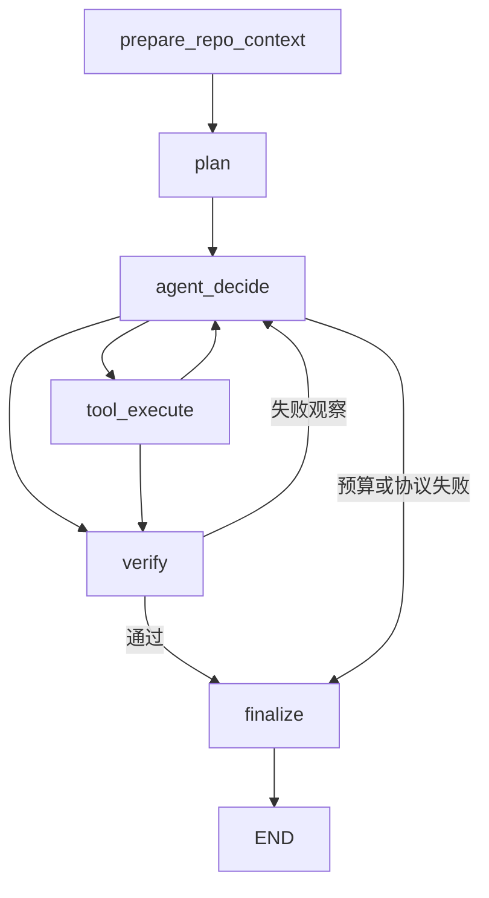

# RepoPilot

一个能读 Python 仓库、修改代码、实际运行测试并复验结果的 Coding Agent。模型只决定下一步，程序负责校验 JSON、审批、工具执行、预算和最终验证。支持 CLI、FastAPI、JSON 会话，以及共享同一业务逻辑的 **Custom / LangGraph 两种 runtime**。

## 先运行，再看架构

需要 Python 3.11+、Git；下面的演示无需模型密钥，并在临时 Git 副本里操作，保留原始 Bug。

```bash
python -m venv .venv
source .venv/bin/activate
python -m pip install -e '.[dev,full]'
python eval/demo.py --runtime custom
python eval/demo.py --runtime langgraph
python eval/demo.py --runtime langgraph --trace
```

Windows PowerShell 将激活命令换成 `.venv\Scripts\Activate.ps1`。两个 runtime 均输出 `Status: completed`、`Tests: passed`；trace 演示向 stderr 导出 24 个实际 span。FakeLLM 使用预写动作，只证明执行链路，不能算真实模型修复能力。

仅需要基础 Custom Runtime 时安装 `.[dev]`。其他功能独立可选：

```bash
python -m pip install -e '.[langgraph]'
python -m pip install -e '.[mcp]'
python -m pip install -e '.[observability]'
repopilot --help
```

缺少 extra 时，相关入口给出安装提示；默认运行不导入 MCP、LangGraph 或 OTel SDK。

## 为什么要有多轮执行

一次模型调用可以生成补丁，但无法利用后续测试失败继续定位。RepoPilot 先用 AST Repo Map、词法 Top-K 和 Python import graph 提供初始上下文，再规划并执行工具；每次观察进入下一轮，最终由程序重新执行计划测试。多轮交互也会增加 token、耗时与循环风险，是否值得必须与同模型 one-shot 比较。



图对应实际 LangGraph 节点与条件边；Custom Runtime 按同样的共享 transition 手动路由。异常路径也会保存会话并结束。

| Custom Runtime | LangGraph Runtime | 共享能力与边界 |
|---|---|---|
| `_run_custom` 有界 while + route | `StateGraph` 六节点 + conditional edges | 同一决策步数上限、工具结果与失败转向 |
| Pydantic `AgentState` | JSON-compatible graph state 内的 AgentState snapshot | 同一动作校验、token 与工具记录 |
| `_tool_step` 手动调度 | `tool_execute` 节点 | 同一 Workspace、审批、Local / Docker executor |
| `_verify` | `verify` 节点 | 实际独立执行测试，失败返回决策 |
| 每步原子 JSON `SessionStore` | 同一 SessionStore + `InMemorySaver` | 内存 checkpoint 可在进程内恢复；跨进程 JSON 从下一次决策继续 |

LangGraph 节点分别执行一个 transition，没有把旧 `run()` 循环包进单一节点。两套 orchestration 复用 [agent.py](repopilot/agent/agent.py) 的业务逻辑。内存 checkpoint 不承诺进程重启持久化，JSON 恢复也不提供工具 exactly-once 语义。

## 从失败轨迹改进 runtime

历史实测出现重复读取，以及补丁已经正确、测试通过后仍重复测试直至 `loop_detection`。

- 同一工具与参数第二次连续出现时，向实际下一轮 prompt 写入结构化 Runtime feedback；成功只读观察在本次 invocation、同一工作区 revision 内复用。
- 第三次要求改变策略，避免第三次执行相同写入或命令；第四次硬停止。总 `max_steps` 仍为 15。
- 当前 revision 的计划测试真实通过后，再次请求同一测试会进入独立 `verify`；修改文件、其他 shell 命令或跨进程恢复都会使旧测试证据失效。
- 最终验证始终真实执行。验证失败后，错误观察返回模型，不能凭模型口头宣称完成。

相邻行区间、轮换工具等不同参数仍可能绕过连续重复检测；运行期间的外部并发修改尚未建立完整版本检测。共享常量兼容性也仍需测试和模型判断，当前没有证据支持新增通用 symbol 算法。

## 只读 MCP

使用官方 MCP Python SDK v2，仅暴露 `repo_map`、`search_code`、`read_file`、`git_diff`：

```bash
repopilot mcp examples/demo_repo
# 或通过官方 client 做完整 stdio 连接、调用与关闭验证
python -m pytest tests/test_mcp_integration.py -q
```

启动命令等待 stdio client 连接，无需密钥。复用 Workspace 的 traversal / symlink / 私有路径限制；读文件最多 512 KB、300 行，工具输出最多 12000 字符。Git diff 禁止外部 diff/textconv，排除 `.env` 和会话内容；非 Git 目录返回明确 tool error。未暴露 shell 或写入工具；已验证官方 client，不声称已连接 Cursor 或 Claude Code。

## 可选 OpenTelemetry

默认 tracing disabled。启用 console 时记录 `repopilot.task`、`retrieval`、`planning`、`agent.turn`、`llm.call`、`tool.*`、`verification` 的实际 span；metadata 包含 runtime、step、token、duration、结果与失败类别。源码、完整 prompt、密钥、hidden tests 与异常正文不写入 span attribute。

```bash
python eval/demo.py --runtime langgraph --trace
python -m pytest tests/test_observability.py -q
```

OTLP/HTTP 也已通过本地真实 collector 的 protobuf 接收验证。配置 `REPOPILOT_OTEL_ENABLED=1`、`REPOPILOT_OTEL_EXPORTER=otlp`、`OTEL_EXPORTER_OTLP_TRACES_ENDPOINT` 为完整 traces URL，例如 `http://127.0.0.1:4318/v1/traces`；该 URL 是部署配置示例，实际 SaaS/Collector 部署需另行验证。`OTEL_EXPORTER_OTLP_ENDPOINT` 作为后备值时也需完整 URL。使用独立 provider；export/flush 失败不改变任务结果。没有已验证的 Langfuse 集成。

## 真实模型、Docker 与 API

真实模型使用 `.env.example` 中的 OpenAI-compatible 配置，默认 Docker executor 与交互审批：

```bash
docker build -f Dockerfile.sandbox -t repopilot-sandbox:dev .
python eval/demo.py --runtime custom --executor docker
python eval/demo.py --runtime langgraph --executor docker
```

对自己的 Git 仓库，入口是 `repopilot run REPO TASK --runtime custom` 或 `--runtime langgraph`，真实模型时去掉演示脚本的 FakeLLM。`repopilot serve --host 127.0.0.1 --port 8765` 提供本机 API；`POST /api/tasks` 的 `runtime` 字段接受 `custom|langgraph`，默认 custom。CLI/API selector 均有 integration test。

Docker 实测覆盖禁网、512 MiB 内存、1 CPU、128 PID、只读容器根目录、无宿主模型 Key、受保护测试只读挂载和超时移除。文件工具检查根目录与符号链接；`ask/auto/never` 审批作用于两个 runtime。`auto` 与 local 仅用于可信副本。Docker 仍共享宿主内核和可写仓库，不构成绝对安全证明。

API 无认证；默认审批 `never`，local 需服务端显式允许，仓库限于 `REPOPILOT_API_ROOT`。任务索引在内存中，重启后用 JSON 会话与 CLI 查历史。Compose 容器内 local 的隔离粒度与 DockerExecutor 不同；本轮未验证 Compose 的真实模型后台任务。

## 评测：能力与执行正确性分开

```bash
python -m pytest -q
python eval/run_benchmark.py --fake --runs 1 --require-all
python eval/run_benchmark.py --fake --runtime langgraph --runs 1 --require-all
python eval/run_one_shot.py --fake --runs 1 --require-all
```

脚本化开发集：Custom Agent、LangGraph Agent、one-shot 均 **25/25**。最终代码完整依赖 CI 为 **89 passed、5 Docker-only skipped**；Docker 独立 job **5 passed**，Windows 基础组合 **59 passed、14 optional/Docker skipped**。[代码 CI](https://github.com/Astrea-296111/RepoPilot/actions/runs/36736511730)、安装组合与实际命令见 [重构报告](docs/18-runtime-mcp-observability-refactor.md)。

外部基准固定 3 个项目的 10 个历史 Bug，每方法每题 3 次，共 60 次真实试验；10 个公开复现 +119 个隐藏参数化用例。运行期保护 public tests，结束后在干净副本注入 hidden tests 评分；隐藏测试不进入 Agent 工作区。任务是目标模块与所需导入快照，不能外推为完整大仓库评测。

**历史全量结果（2026-09-30，qwen3.8-max）：** Agent patch resolved **25/30**、completed + resolved **23/30**；one-shot **28/30**。Agent / one-shot token 中位数 **34337.5 /5003**，端到端中位数 **123.904 /36.492 秒**。[历史 run](https://github.com/Astrea-296111/RepoPilot/actions/runs/36677551664)、[原始证据](eval/evidence/2026-09-30)、[旧报告](docs/17-外部历史Bug实测结果.md) 保留不变。该结果没有证明 Agent 优于 one-shot。

本轮预注册四个风险任务、每方法每题 3 次：Agent patch / completed 均 **12/12**，同轮 one-shot **7/12**；历史同范围为 7/12、5/12 与 10/12。随后固定 60 次全量复跑中，Agent patch 为 **27/30**、completed + resolved 为 **26/30**，one-shot 为 **28/30**；Agent / one-shot token 中位数 **32642 /4946.5**、端到端中位数 **103.693 /38.398 秒**。全量仍未证明多轮优于 one-shot；research 从定向 3/3 变为全量 0/3，参数漂移读取、连接超时与空流式正文异常全部保留。[全量 run](https://github.com/Astrea-296111/RepoPilot/actions/runs/36730079890)、[原始分片与 hash](eval/evidence/2026-09-30-refactor/full)、[本轮报告](docs/18-runtime-mcp-observability-refactor.md) 给出 commit、日期、前后指标及失败分析。不混合 targeted 与 full 分母，重复试验不能写成独立 Bug 数；模型服务别名可能变化，历史比较属于描述性对照。

普通 push / PR 只运行无付费模型 CI，覆盖 base/full extras、官方 MCP stdio、OTel、包装、CLI 与 Docker。真实模型 workflow 必须显式 opt-in；`workflow_dispatch` 选择 scope/runtime，或授权提交使用 `[external-targeted]` / `[external-eval]` 标记，完整 raw artifact 与严格配对报告均保存。工作流成功不等于所有补丁通过。

## 阅读与面试材料

- [本轮架构、验证命令、评测与未验证项](docs/18-runtime-mcp-observability-refactor.md)
- [3 条简历 bullet、90 秒介绍、runtime 追问表、10 个问题](docs/16-项目STAR与简历.md)
- [外部评分协议](docs/15-外部历史Bug评测协议.md)；[开发集检索实验](docs/14-秋招项目讲述与量化.md)
- [从零教程](docs/00-项目总览.md)；[第三方参考说明](THIRD_PARTY_NOTICES.md)

当前优先级：新增独立任务和完整仓库集成、评估共享行为回归、完善命令策略/API 认证/持久化任务索引、大仓库增量检索。所有新策略先做对照，再决定是否保留。
