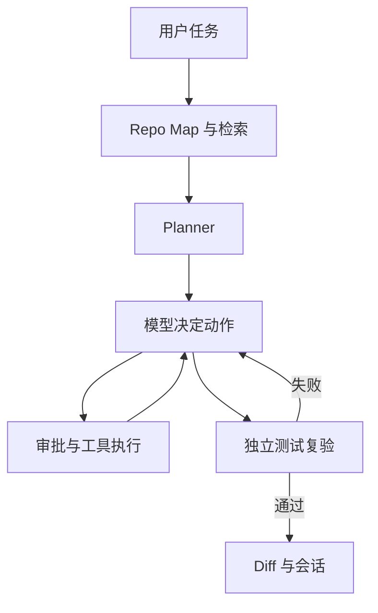

# 00｜先看全局：一句需求怎样变成代码改动

你可以把普通聊天机器人理解成给你出主意的人：你描述 Bug，它回答一段文字。如果它从未见过你电脑里的仓库，也没跑过测试，这段回答不等于修复。RepoPilot 则像坐在你的项目旁边的实习工程师：先看目录和函数，再打开几份文件，提出计划，动手改一处，运行测试，根据报错决定下一步。

本套教程始终使用一个请求：「修复重复邮箱注册错误」。Demo 的 `UserService.register` 在邮箱已存在时抛 `ValueError`，但测试要求 `DuplicateEmailError`。原始测试 1 failed；修复后 1 passed。我们的 FakeLLM 会按预写动作复现整个工具流程；真实模型另有 10 个历史 Bug、每题每方法 3 次的外部评测，见 [历史报告](17-外部历史Bug实测结果.md)。本轮已加入真实 LangGraph 状态机、只读 MCP 与可选 OTel，架构和最新证据见 [重构报告](18-runtime-mcp-observability-refactor.md)。

三个分工：`repopilot/context/` 决定给模型看什么；`repopilot/agent/` 让它一步一步选择动作；`repopilot/tools/` 真正访问文件和命令。`repopilot/sandbox/docker.py` 只负责命令容器，`repopilot/session/store.py` 记录过程。CLI/API 是统一入口。Custom 与 LangGraph 只改变 orchestration，共享工具、审批、context 和验证逻辑。

为什么多一个工具循环？模型只说「应该抛正确异常」不够；程序得真的打开 `app/users.py`、改那一行、跑 `python -m pytest -q`。测试一旦失败，报错就是下次思考的新证据。最终输出必须有程序重新运行的测试结果，不能相信模型写的「已通过」。

从 `README.md` 的 Demo 开始，先自己运行失败测试，再在临时副本上运行 `--fake-demo`；接着阅读第 01～07 章，最后看第 09 章面试问答。每章讲的代码都在 `repopilot/` 下。

### 这一章你面试时应该能说什么

「这是一个小型软件工程 Agent。它把仓库概览、代码检索、计划、工具调用、测试观察和重试串成可审查的闭环。我用一个故意失败的重复邮箱例子验证工作流，但没有用它冒充真实模型基准。」

### 可能的追问

1. 只让模型输出一份 patch，和 Agent 有什么区别？
2. 最终测试是谁执行的？
3. Demo 证明了哪些事，没有证明哪些事？
4. 失败结果怎样进入下一轮？

