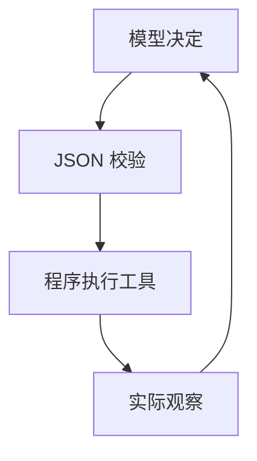

# 01｜Agent 到底是什么

先把 LLM 想成桌前会思考的人。它读得懂需求，但本身没有你的仓库，也不会凭一句回答真的敲键盘。`read_file` 像眼睛，`apply_patch` 像手，`run_command` 像在电脑上运行测试。工具把实际结果送回来，这个结果叫 **Observation（观察）**。

假设它想「重复邮箱时发生了什么」。模型发出一个 JSON 动作，程序校验后读取 `app/users.py`，然后把真实文件内容返还。模型发现 `raise ValueError(...)`；它再用命令工具看到测试失败；随后改为 `raise DuplicateEmailError(email)`，再跑测试。模型不是直接执行 shell，Python 程序才有访问文件和进程的权限。

**State（状态）**就是工程师手边的工作日志：任务、计划、步数、消息、工具历史、改了哪些文件、测试状态和用量。状态定义见 `repopilot/agent/state.py`；每轮落盘由 `repopilot/session/store.py` 完成。它让重启后的继续执行有依据，也方便复盘失败，而不是让模型假装记得所有事。

**Agent Loop（循环）**就是「想一下→动一下→看结果→再想一下」。入口在 `repopilot/agent/agent.py:RepoPilot.run`；Custom 循环在 `_run_custom`，LangGraph 用六个节点表达同一 transition。模型决定下一步，工具给事实，程序控制边界：权限、步数、测试复验。Plan 相当于待办清单，可以提供方向，但如果实际观察和计划矛盾，应根据观察修正。

这不是「模型越聪明，程序就不用管」：模型可能格式写错、误判文件、重复同一命令或声称测试通过。`parse_action`、`_permitted`、loop detection 和最终 `_execute("run_command", ...)` 分别处理这些问题。

### 这一章你面试时应该能说什么

「Agent 是模型、工具、观察、状态和循环的组合。模型只选动作，程序验证并执行工具，把真实结果再反馈给模型；状态持久化记录整个过程。」

### 可能的追问

1. Observation 和模型生成的回答有什么区别？
2. 为什么模型不直接访问文件系统？
3. Agent State 保存哪些字段？
4. Planner 和 Agent Loop 是什么关系？

