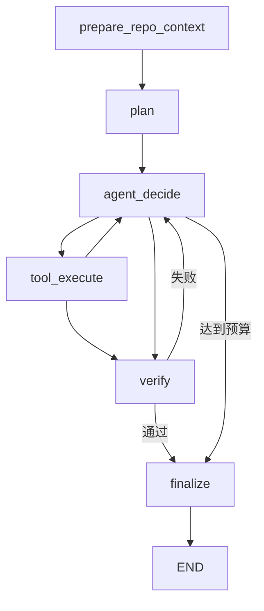

# RepoPilot Runtime / MCP / Observability 重构验证报告

日期：2026-09-30（UTC）。本报告区分代码验收、脚本化回归和真实模型试验；模型 miss 保留为结果，不以 workflow success 代替 patch success。

## 基线与交付版本

| 项目 | 可核查记录 |
|---|---|
| `BASE_HEAD_SHA` | `bfbfa46089a489e6763f1405f45a4301ec5f6e87` |
| `BASE_TEST_RESULT` | Python 3.12.14，修改前 `33 passed in 17.07s` |
| `BASE_FAKE_BENCHMARK_RESULT` | Custom Agent 25/25；one-shot 25/25 |
| `BASE_EXTERNAL_REPORT` | [17｜历史实测](17-外部历史Bug实测结果.md)，原始结果保持不变 |
| 历史外部评测 commit | `ff9d52b6164b58c17d33a8dd3a17802765487965` |
| 历史外部 workflow | [36677551664](https://github.com/Astrea-296111/RepoPilot/actions/runs/36677551664)，2026-09-30 06:18:24–06:59:02 UTC |
| 基线普通 CI | [36688972457](https://github.com/Astrea-296111/RepoPilot/actions/runs/36688972457) |
| `FINAL_CODE_SHA`（最终可执行代码；后续仅文档与证据） | `74aa01887c3cf2fb2a32cf5b10161cfcfc54756b` |
| 最终代码普通 CI | [36736511730](https://github.com/Astrea-296111/RepoPilot/actions/runs/36736511730)，Windows / Linux base / Linux full / Docker 全绿，两个 Docker CLI 演示实际 completed；[命令与 job 证据](../eval/evidence/2026-09-30-refactor/final-ci-verification.json) |
| 全量真实模型实际执行版本 | `192627da77a2520df07d5e5b9c87e03e9424bfaf`；与最终代码差异为独立 Git 边界和 OTLP 配置修复，详见下文 |
| 演示入口 commit | `a121b18e23d628e7d8ab57eb7498d86a62e95c69`，仅新增演示、示例配置与 CI 演示步骤，runtime 与评分器不变 |

基线审计的命令与 raw hash 见 [baseline.json](../eval/evidence/2026-09-30-refactor/baseline.json)。旧证据 manifest 的所有文件 hash 已重新校验。外部任务、allowed source、public/hidden tests 的冻结 suite SHA-256 始终为：

`fc0eb01fc240b1147a93e465b9c96a0a1f96916b932c1c8ceedd4f0b30eb8987`

## 改了什么、为什么这样改

| 模块与文件 | 实际变化 | 选择原因 |
|---|---|---|
| [agent.py](../repopilot/agent/agent.py)、[state.py](../repopilot/agent/state.py) | 提取 prepare / plan / decide / tool / verify / finalize transition；保留 Custom while 默认入口 | 自研 runtime 便于直接解释状态、预算和失败语义，也避免将整个项目换成框架 Demo |
| [runtime/langgraph.py](../repopilot/runtime/langgraph.py) | `StateGraph(GraphState)` 六节点、条件边、bounded feedback、`InMemorySaver` | 让 orchestration 由图表达，同一业务策略可做行为对照，不维护两套工具逻辑 |
| [cli.py](../repopilot/cli.py)、[api/server.py](../repopilot/api/server.py) | runtime selector；CLI resume 使用原 runtime；Windows 重定向使用 UTF-8 | 保持 custom 默认兼容，并让实际 CLI/API 能选择与恢复 LangGraph |
| [mcp_server.py](../repopilot/mcp_server.py)、[tools/repo_map.py](../repopilot/tools/repo_map.py)、[tools/git.py](../repopilot/tools/git.py) | 官方 MCP v2 stdio；四个只读工具；Git diff 不运行外部 helper，不输出私有 `.env`/会话 diff | 标准化仓库观察能力，V1 不对外开放写入或 shell，也不绕过 Workspace 边界 |
| [observability.py](../repopilot/observability.py)、[config.py](../repopilot/config.py) | 默认关闭，console / OTLP HTTP exporter，独立 provider 和 metadata allowlist | 无 SaaS 也能运行；exporter 故障不改变 Agent 结果，避免源码/密钥进入普通 span |
| [context/manager.py](../repopilot/context/manager.py) | Runtime feedback 真正写入下一轮预算内 prompt | 旧 system message 只留在 transcript，单独记录并不意味着模型实际看到反馈 |
| [pyproject.toml](../pyproject.toml)、[.env.example](../.env.example) | langgraph / mcp / observability / full extras，tracing 示例默认关闭 | 基础安装维持轻量；缺少 optional SDK 时给明确安装错误 |
| [eval/run_external_actions.py](../eval/run_external_actions.py)、[summarize_targeted.py](../eval/summarize_targeted.py) | 固定四题 scope、三次重复；严格拒绝缺失/重复/混配置分片 | 先验证历史风险任务，固定分母和对照条件，防止根据结果挑样本 |
| [workflows](../.github/workflows)、[eval/demo.py](../eval/demo.py) | 扩展现有 workflows；base/full extras、真实 Docker、临时副本 CLI 演示 | 每项能力以可执行命令和 integration evidence 验收，普通 push 不调用付费模型 |

阶段提交：

| 阶段 | GitHub commit |
|---|---|
| 审计与回归保护 | `be53b5472b65a9cbb0b5017bdd85bc564173d548` |
| LangGraph | `f1bfade6274e8c814cf558871ed24a3938a30985` |
| MCP | `919032372fb3879279d8bbe6ed0afbc118fe9692` |
| OTel | `6d997b6b0e4929171c881ac27ba422b40f1aaee5` |
| recovery / termination | `0110c98ee4c5a6005050d5a09c95e344bff5d995` |
| CI / 固定评测 scope | `9c3e02e2aed67edd1ac4dc9bb6cff21b64f5a6ab` |
| Windows 编码修复 | `3037cfe06aa81e779f79722abeb8ee81f9061a22` |
| targeted 预注册并执行 | `68a4c49a72d9f61fe0ee7daabcf55c43147b999e` |
| 一键 CLI/Docker 演示 | `a121b18e23d628e7d8ab57eb7498d86a62e95c69` |
| targeted 完整证据与 full 调度等待上限 | `192627da77a2520df07d5e5b9c87e03e9424bfaf` |
| Git literal 路径边界 / OTLP endpoint 回退 | `74aa01887c3cf2fb2a32cf5b10161cfcfc54756b` |

## 两个 runtime 的实际状态机



每个 LangGraph node 只执行一项共享 transition。`agent_decide` 选择 tool / verify / finalize，`tool_execute` 可继续决策或转独立验证，`verify` 失败回 agent。节点异常记录失败、保存状态并去 finalize。没有节点调用 `_run_custom`；测试也把该方法替换成抛错函数来确认图不依赖旧循环。

| 维度 | Custom | LangGraph |
|---|---|---|
| orchestration | 手动 while 与 route | StateGraph 六节点、conditional edges |
| state | Pydantic AgentState | JSON-compatible dict snapshot，节点重建 AgentState |
| context / model / tools | 同一实现 | 同一实现 |
| safety / approval | Workspace、受保护路径、executor、审批 | guarded shared transition，不绕过旧策略 |
| decision budget | `max_steps`，默认 15 | 同一 decision budget，另有 graph recursion limit `3 * max_steps + 10` |
| verification | 程序独立执行计划测试 | verify node 调同一方法 |
| persistence | 每步原子 JSON SessionStore | 同一 JSON bridge + InMemorySaver |

**checkpoint 边界：** 测试通过 `interrupt_after=['tool_execute']` 编译图，在同一进程内用 `thread_id` checkpoint 恢复，确认已执行工具不重放。新实例使用 JSON SessionStore 从下一次决策继续，校验 repo/task/runtime/executor/approval 一致，清除旧 passing evidence，并保留累计 decision budget。内存 checkpointer 不是持久数据库；节点和外部工具之间也没有分布式事务，进程崩溃时不承诺 exactly-once。

## 重复恢复、成功终止与失败转向

修改前从 raw trajectory 确认：`boltons_research` 三次重复均反复读取相邻行区间并 loop stop；`more_predicate_sentinel` 两次生成正确补丁、公开测试通过后反复测试，终态却 loop stop；`slugify_hex` 和 `slugify_truncation` 各一次出现共享/旧行为兼容性回归。

本轮策略：

1. 指纹为工具名 + 排序后的参数；第一次执行，第二次连续重复开始 feedback。成功的 read/search/diff 在相同 invocation 与 workspace revision 复用已有观察，重新检查路径策略。
2. 第三次给一次有界转向机会，提示检查依赖/call sites、其他实现或根据已有证据修改；不第三次执行相同写入/命令。第四次相同决定硬停止，总步骤不放宽。
3. 计划测试在当前 revision 真正通过后，模型再次请求同一命令时，程序立即进入独立最终验证并 finalize，而不是缓存成功或无限重复。
4. 文件修改、其他 shell 命令和跨进程恢复使旧测试证据失效；最终验证失败清除重复计数，并将 authoritative failure feedback 放进下一轮实际 prompt。

这些是代码策略与 deterministic 序列回归；不依赖模型是否听从文字提醒。`tool_calls` 保留历史 observation 数口径，可能包含 cache/withheld record；新增 `executed_tool_calls` 统计实际 dispatch，包含最终验证，排除缓存/审批拒绝。旧数据没有 cache 字段时按原工具记录数处理，不能把两者混作完全同一指标。

没有加入按 benchmark 名称的特判，也没有未经对照支持的向量/BM25/shared-symbol 算法。对共享行为的兼容性回归，本轮保留固定隐藏评分来判断，不能仅凭新的 runtime 策略宣称已解决。

## 实际命令与确定性验收

在已激活 Python 3.12.14 venv 中执行安装与本地集成；CI 另测 Python 3.11 base、3.12 full 和 Windows base。

| 实际命令 | 验证结果/证据 |
|---|---|
| `python -m pip install -e '.[dev]'` | 基础安装通过；原始基线 33 tests 全过 |
| `python -m pip install -e '.[langgraph]'` | 安装成功，真实 graph 与 CLI 可用 |
| `python -m pip install -e '.[mcp]'` | 官方 v2 SDK 安装成功 |
| `python -m pip install -e '.[observability]'` | SDK 与 OTLP HTTP exporter 安装成功 |
| `python -m pip install -e '.[dev,full]'`、`python -m pip check` | full 自引用 extra 安装成功，无 broken requirements |
| `python -m pip wheel --no-deps . --wheel-dir /tmp/repopilot-final-wheel` | 最终 README 下 wheel 构建成功；pip check、import 与 `repopilot --help` 通过 |
| `repopilot serve --host 127.0.0.1 --port 8765` | 实际启动 Uvicorn，HTTP `/health` 返回 `status=ok`，随后正常关闭；未调用模型 |
| `python -m pytest -q` | 最终代码 CI `89 passed, 5 skipped in 64.44s`；此前本地 `86 passed, 5 skipped in 98.90s`，随后增加 2 个调度入口和 1 个 MCP 边界测试；5 个跳过项由独立 Docker job 实测 |
| `python eval/run_benchmark.py --fake --runs 1 --require-all` | Custom 25/25 |
| `python eval/run_benchmark.py --fake --runtime langgraph --runs 1 --require-all` | LangGraph 25/25 |
| `python eval/run_one_shot.py --fake --runs 1 --require-all` | one-shot 25/25 |
| `python eval/demo.py --runtime custom` | 真实 CLI subprocess completed，实际测试 passed |
| `python eval/demo.py --runtime langgraph` | 真实 CLI subprocess completed，实际测试 passed |
| `python eval/demo.py --runtime langgraph --trace` | completed，24 个实际 console span，[demo-verification.json](../eval/evidence/2026-09-30-refactor/demo-verification.json) |
| `python -m pytest tests/test_mcp_integration.py -q` | 最后本地 5 passed in 3.80s：官方 client 完整 stdio 与内存 transport、四工具、越界/私有路径/大小/非 Git/关闭，以及 Git 特殊路径名边界 |
| `python -m pytest tests/test_observability.py -q` | 9 passed in 12.71s；memory exporter 树、token/duration/status、默认关闭、bad config、exporter failure、真实 OTLP HTTP protobuf 接收 |
| `python -m pytest tests/test_observability.py tests/test_optional_integrations.py -q` | 最后本地 12 passed in 21.73s；真实 OTLP 接收测试另验证空专用 endpoint 回退到通用完整 traces URL |
| `python -m pytest tests/test_runtime_recovery.py -q` | 13 passed in 14.16s；参数化场景，两个 runtime 共用恢复/终止/复验规则 |
| `python -m pytest tests/test_optional_integrations.py tests/test_langgraph_runtime.py::test_graph_cli_smoke -q` | 本地最后一次 4 passed in 12.79s；缺 SDK 安装提示和 UTF-8 CLI 均验证 |

最终基础环境组合 `59 passed, 14 skipped`：Windows 35.96s，Linux Python 3.11 为 8.02s；14 个 skip 来自未安装 optional SDK 的集成模块及 Docker opt-in。额外依赖组合不会因需要 SaaS 而崩溃。第一次普通 CI 的 Windows 失败来自重定向 cp1252 与默认文本解码，已显式 UTF-8 修复并整轮全绿；没有删掉 Windows 测试避开失败。

完整命令摘要与历史本地中间结果保存于 [local-verification.json](../eval/evidence/2026-09-30-refactor/local-verification.json)。最终代码证据独立保存在 [final-ci-verification.json](../eval/evidence/2026-09-30-refactor/final-ci-verification.json)，不将早期 79/86/88 passed 与最终 full CI 的 89 passed 混用。

## MCP 与 OTel：验证到哪一层

MCP 使用官方 [Python SDK v2](https://py.sdk.modelcontextprotocol.io/) 的 `MCPServer`、`Client`、`StdioServerParameters`。stdio client 实际启动 `python -m repopilot.cli mcp REPO`，执行 list_tools 和四个工具，检查 traversal、symlink、`.env`、`.git`、session 路径拒绝，再关闭 subprocess。内存 client 还验证文件/output limits 与非 Git 错误。readonly annotations 与实际工具集合都受测试覆盖；没有开放 apply_patch/write_file/run_command，没有验证第三方编辑器接入。

最后边界审计发现真实 POSIX 文件名 `:(top)` 会被 Git 当作 pathspec magic，可能从嵌套 workspace 选中父仓库内容。修复将正向用户路径标记为 `:(literal)`，只保留应用写出的私有路径 exclusion 为 magic。官方 client 测试同时验证默认 diff 与指定文件不输出父仓库 tracked 内容或 untracked 文件名；[修复前复现与修复后验证](../eval/evidence/2026-09-30-refactor/git-literal-path-verification.json)。Windows 不允许这种文件名，相关场景由 Linux full CI 验证。

OTel 使用官方 SDK 独立 provider。`repopilot.task` 是根 span；retrieval、planning、agent.turn、tool.*、verification 是任务阶段，LLM 属于对应 planning/turn，最终 run_command 是 verification 子 span。只记录 allowlist scalar metadata；不自动记录 exception body。FakeLLM 的 usage 为 0；单测使用带 usage 的 model fixture 校验数值，不能把零 token 演示写成模型成本节省。

console demo 的真实 span 名称包括 `repopilot.task`、`retrieval`、`planning`、`agent.turn`、`llm.call`、`tool.read_file`、`tool.apply_patch`、`tool.run_command`、`tool.git_diff`、`verification`。演示强制 `OTEL_TRACES_SAMPLER=always_on` 以便观察；应用本身尊重已有 sampler 配置。

OTLP test 启动本地 HTTP 接收端，使用实际 exporter POST 并解码官方 protobuf；它证明协议出口，不代表已部署 Langfuse/Jaeger/SaaS。console 输出到 stderr，stdio stdout 保留给协议。exporter 异常与 bounded flush 不改变完成结果。

版本范围：LangGraph `>=1.2.12,<1.3` 固定本次验证的 minor API；MCP `>=2.2,<3` 使用当前 v2 API 并防止跨 major；OTel SDK/exporter `>=1.45,<2` 对齐同一验证版本。实际安装为 LangGraph 1.2.12、MCP 2.2.0、OTel 1.45.0。依据官方 [LangGraph persistence](https://docs.langchain.com/oss/python/langgraph/persistence)、[MCP client transport](https://py.sdk.modelcontextprotocol.io/client/transports/)、[OTel instrumentation](https://opentelemetry.io/docs/languages/python/instrumentation/) 实现，并以当前安装 SDK 的 integration test 确认可用。

## Docker 与 Actions

本地没有 Docker；通过 [最终代码真实 Docker job](https://github.com/Astrea-296111/RepoPilot/actions/runs/36736511730/job/109961538368) 验证，而不是把 mock 或语法检查当成 Docker 已运行：

- sandbox image 实际 build。
- `REPOPILOT_DOCKER_TESTS=1 python -m pytest tests/test_docker_integration.py -q`：**5 passed in 14.26s**。
- `python eval/demo.py --runtime custom --executor docker` 与 `--runtime langgraph --executor docker` 两个 CLI 命令实际 completed、tests passed；Custom / LangGraph trusted demo 真正执行、独立验证通过；protected tests 只读挂载拒绝 shell 改写。
- cgroup 验证 512 MiB /1 CPU /128 PID，network 无默认路由，readonly rootfs、tmp 可写、NoNewPrivs、宿主模型 Key 不继承。
- 超时路径移除容器；`eval/Dockerfile.external` 实际 build，再校验全部 10 个破损基线与上游参考修复。

普通 CI 扩展现有 Windows workflow，增加 Linux extras matrix 与 Docker job。付费外部 workflow 必须 dispatch 的 `run_real_model=true`，或当前授权提交显式包含 `[external-targeted]` / `[external-eval]`；普通 push/PR 不消费模型额度。Actions 只通过 env 使用既有 Secret，本轮没有读取、打印或复制 Secret。

## 真实模型评测

历史全量：10 个独立 Bug ×3 repeats ×2 methods =60 trials，qwen3.8-max，temperature 0、reasoning medium、stream true、model timeout 180s、max steps 15、context 30000 chars、Docker。固定 129 个 public+hidden pytest cases；suite、task prompt、allowed source、测试与评分口径不变。

| 历史全量方法 | patch resolved | completed + resolved | token 中位数 | 端到端秒中位数 |
|---|---:|---:|---:|---:|
| Custom Agent | 25/30 | 23/30 | 34337.5 | 123.904 |
| one-shot | 28/30 | 28/30 | 5003 | 36.492 |

本轮 targeted 先固定 `boltons_research`、`more_predicate_sentinel`、`slugify_hex`、`slugify_truncation`：4 bugs ×3 ×2 =24 trials，Agent 选择 Custom Runtime。预注册证据见 [targeted-protocol.json](../eval/evidence/2026-09-30-refactor/targeted-protocol.json)；评测 [36720727948](https://github.com/Astrea-296111/RepoPilot/actions/runs/36720727948)，执行 commit `68a4c49a72d9f61fe0ee7daabcf55c43147b999e`。历史同范围 Agent patch 7/12、completed+resolved 5/12、loop detection 5；one-shot 10/12。24 条记录全部完成，严格重算 JSON 与 Actions 原报告一致；[manifest / hash](../eval/evidence/2026-09-30-refactor/targeted/manifest.json)、[原始分片](../eval/evidence/2026-09-30-refactor/targeted/shards)、[配对报告](../eval/evidence/2026-09-30-refactor/targeted/external-comparison.md) 和 [轨迹审计](../eval/evidence/2026-09-30-refactor/targeted/trajectory-audit.json) 均已封存。运行时间 13:18:48–14:20:37 UTC。

| 范围/阶段 | 方法 | patch resolved | completed + resolved | loop / max steps / protocol | steps 中位数 | 工具记录 / 实际 dispatch 中位数 | token 中位数 | 端到端秒中位数 |
|---|---|---:|---:|---:|---:|---:|---:|---:|
| 同四题历史切片 | Agent | 7/12 | 5/12 | 5 /0 /0 | 7 | 6 /6 | 50781 | 187.462 |
| 同四题历史切片 | one-shot | 10/12 | 10/12 | 0 /0 /0 | — | — | 6010 | 56.966 |
| 本轮 targeted | Agent | 12/12 | 12/12 | 0 /0 /0 | 7.5 | 8.5 /8 | 50297.5 | 154.870 |
| 本轮 targeted | one-shot | 7/12 | 7/12 | 0 /0 /0 | — | — | 6128.5 | 53.090 |

| 任务 | Agent patch / completed 通过 | one-shot 通过 |
|---|---:|---:|
| boltons_research | 3/3；3/3 | 1/3 |
| more_predicate_sentinel | 3/3；3/3 | 3/3 |
| slugify_hex | 3/3；3/3 | 1/3 |
| slugify_truncation | 3/3；3/3 | 2/3 |

实际轨迹中，12 次 Agent 全部含成功的独立最终验证；8 次触发“测试已通过后的再次请求转最终验证”；5 条成功只读观察被复用，107 条工具观察对应 102 次实际 dispatch。历史研究任务全部 loop stop，本轮三次在 13/13/9 个 decision 内修好，均在原 15 步预算内。这支持机制确实被执行，不构成单因素因果估计。

代价仍很明显：Agent 本轮总 usage 913866 tokens，历史同范围为 691309；最长单题 1595.108 秒，三个 research trial 合计 3540.560 秒。中位数略低不意味着总 token/长尾都改善。one-shot 的五次 miss 原始记录全部保留，其中三次为精确 old_text 匹配异常，另有隐藏回归失败。四题选自历史风险，模型别名也可变化；不能把 12/12 外推为通用成功率。

### 固定全量复跑

targeted 完整、deterministic CI 全绿后，执行固定 10 bugs ×3 repeats ×2 methods 的 60 次复跑：[36730079890](https://github.com/Astrea-296111/RepoPilot/actions/runs/36730079890)，source commit `192627da77a2520df07d5e5b9c87e03e9424bfaf`，预注册 [full-protocol.json](../eval/evidence/2026-09-30-refactor/full-protocol.json)。runtime / model / temperature / reasoning / context / max steps / 任务 / public+hidden tests / scoring 均未根据 targeted 新结果调优。

调度差异单独记录：full 每分片含两道题、六次试验，targeted 每分片一道题、三次；测得 research 单分片接近一小时，因此只把 full 整组子进程上限设为 5400 秒、job 上限 100 分钟（targeted 仍为 3900 秒/70 分钟）。LLM 的 180 秒 read timeout、Docker 测试的 60 秒定义、每 trial timer 和评分规则保持不变。这是评测前记录的批次调度差异，不声称所有 timeout 配置完全相同。

本轮 full 于 **14:34:02–15:29:33 UTC** 完成。严格校验全部 60 个 `(method, task, repeat)` key、10 个分片和冻结 hash；重算 JSON/Markdown 与 Actions 原报告逐字节相同。[manifest](../eval/evidence/2026-09-30-refactor/full/manifest.json)、[全部 raw shards](../eval/evidence/2026-09-30-refactor/full/shards)、[报告](../eval/evidence/2026-09-30-refactor/full/external-comparison.md)、[失败轨迹审计](../eval/evidence/2026-09-30-refactor/full/trajectory-audit.json) 均已归档；定向记录没有进入这个分母。

| 全量阶段 | 方法 | patch resolved | completed + resolved | loop / max steps / JSON protocol | steps 中位数 | 工具记录 / 实际 dispatch 中位数 | token 中位数 | 端到端秒中位数 |
|---|---|---:|---:|---:|---:|---:|---:|---:|
| 历史 | Agent | 25/30 | 23/30 | 5 /0 /0 | 4 | 5 /5 | 34337.5 | 123.904 |
| 历史 | one-shot | 28/30 | 28/30 | 0 /0 /0 | — | — | 5003 | 36.492 |
| 本轮 full | Agent | **27/30** | **26/30** | 0 /1 /0 | 5 | 6 /5.5 | 32642 | 103.693 |
| 本轮 full | one-shot | **28/30** | **28/30** | 0 /0 /0 | — | — | 4946.5 | 38.398 |

| 全量阶段 | Agent 总 tokens /最长 trial 秒 | one-shot 总 tokens /最长 trial 秒 |
|---|---:|---:|
| 历史 | 1296515 /952.422 | 164566 /171.681 |
| 本轮 | 1261197 /1727.493 | 166346 /128.218 |

Agent 26 次正常完成均执行成功的独立最终验证；其中 5 次由成功测试后的重复请求转入验证。5 条只读观察被复用，179 条工具记录对应 174 次实际 dispatch。`loop_detection` 从历史 5 次到本轮 0 次，只描述完全相同连续动作的终止记录：research repeat 1 仍用完 15 步读取相邻或交替区间，未产生补丁。没有 loop stop 不等于没有无效循环。

| 保留的异常试验 | 结果与原因 |
|---|---|
| boltons_research，Agent repeat 1 | 失败，15 步耗尽，1727.493s；参数漂移/非连续读取没有被现有 guard 覆盖 |
| boltons_research，Agent repeats 2/3 | 失败，ConnectTimeout；分别 804.289s /324.304s；未重跑或删除 |
| boltons_backoff，Agent repeat 3 | 补丁评分通过，但后续模型流式响应缺少正文，未进入独立最终验证，终态 failed；因此 patch 27 与 completed 26 不相同 |
| slugify_hex /slugify_truncation，one-shot repeat 3 | 两次精确 old_text 匹配错误，计入失败分母 |

JSON/ValidationError protocol 指标为 0，不包括上述空正文、连接错误和补丁应用错误；不能将其解释为所有协议/执行过程均无异常。full research 为 0/3，而 targeted 为 3/3，说明定向成功没有稳定复现到全量运行。Agent 本轮生成的 27 份补丁均通过固定公开+隐藏评分，但仅是这 10 题的观察，没有证明通用 shared-symbol 策略已解决。

**结果解释：** 全量 Agent patch 比历史多 2 次、completed+resolved 多 3 次，但仍少于同轮 one-shot 的 28/30，且 token 中位数约为 6.6 倍、耗时中位数约为 2.7 倍。本轮配对成功率差为 −3.33 个百分点，按 10 个任务重采样区间约 [−30.00, 13.33]，不支持优于 one-shot 的结论。历史与本轮模型别名相同但不同时，只有 10 个相关 task clusters，公开上游修复可能进入训练数据；这些是描述性对照，不做因果或通用修复率宣称。

全量付费运行之后，`74aa018...` 修复了 Git literal 路径与空 OTLP endpoint 回退，并新增相关测试。未改模型、恢复策略、任务、评分或预算；冻结任务没有 Git magic-looking 文件名。该修复通过最终普通 CI，但没有再消费 60 次模型试验。因此本报告明确区分付费执行 commit `192627da...` 与最终代码 commit `74aa018...`。

重算命令（无需模型密钥）：

```bash
python eval/summarize_targeted.py eval/evidence/2026-09-30-refactor/targeted/shards --output /tmp/repopilot-targeted-comparison.json
python eval/summarize_external.py eval/evidence/2026-09-30-refactor/full/shards --output /tmp/repopilot-full-comparison.json
```

## 已知限制与未验证项

1. Paid evaluation 使用 Custom；LangGraph 通过 deterministic 同任务/失败/安全/CLI/API/checkpoint 对照，未单独完成同规模真实模型 runtime 成本比较。
2. 测试能验证有限场景；MCP readonly hint 不是操作系统隔离，stdio 外部编辑器与恶意协议客户端未验证。
3. OTLP 验证到本地 HTTP/protobuf 出口；没有 SaaS、Langfuse 或生产 collector 故障/高吞吐验证。
4. InMemorySaver 不跨进程持久化，JSON SessionStore 不提供 exactly-once 或分布式调度；API task ID 索引仍在内存。
5. readonly cache 依赖应用内 workspace revision；运行期外部并发编辑、交替动作、仅调整 read 区间等循环尚未完整检测。
6. 模型兼容性推理并未被通用算法解决；public tests 通过不能代替 hidden/完整回归。没有因为新技术栈就删掉旧失败。
7. Docker 共享宿主内核，workspace 可写，镜像/daemon 供应链仍有边界；本轮未做恶意代码攻防、API 认证或 Compose 真实模型后台 E2E。
8. 外部套件只有 10 个独立 Bug、三个项目的模块快照；三次重复不独立，模型 alias 可变化，历史/当前 run 不同时，不给统计显著性或大仓库泛化结论。
9. 当前 context budget 按字符计；token 数只累计已返回的 provider usage，报错/截断调用可能没有完整 usage，不能当成全部账单。FakeLLM 的零用量不是节省率。
10. `LLM_TIMEOUT_SECONDS=180` 保持原 HTTPX 单次 read timeout 定义。持续返回 stream chunk 的调用总耗时可能超过 180 秒；没有为了改善成绩改成新的 end-to-end deadline。workflow/子进程另有整体时间上限，长尾可能影响整组完成。

## 最终验收清单

以下是本轮已执行范围；未验证部署与泛化能力仍按上一节列出，不因打勾扩大范围。

文件 hash、文档链接和交付材料的结构检查见 [final-consistency-verification.json](../eval/evidence/2026-09-30-refactor/final-consistency-verification.json)。

- [x] baseline / 最终可执行 commit 已记录：本报告版本表、baseline.json。
- [x] base pytest：Windows / Linux 均 59 passed、14 skipped，最终代码 CI。
- [x] fake Agent：Custom 25/25，最终代码 CI。
- [x] fake one-shot：25/25，最终代码 CI。
- [x] Custom 默认入口保持可运行：CLI、25 题、完整模型评测均使用同一 runtime。
- [x] LangGraph 为真实六节点图：[源码](../repopilot/runtime/langgraph.py)；测试禁止旧循环调用。
- [x] LangGraph CLI/demo 实际 completed：本地、console trace、真实 Docker CLI。
- [x] LangGraph success/failure/budget/checkpoint/API tests：[test_langgraph_runtime.py](../tests/test_langgraph_runtime.py)，full CI。
- [x] MCP server 实际启动：stdio client 启动 CLI subprocess 并正常关闭。
- [x] 官方 MCP client integration：list_tools、四工具和内存 transport，[tests](../tests/test_mcp_integration.py)。
- [x] MCP traversal / symlink / 私有文件 / 大小 / Git literal 路径边界：5 个测试，Linux full CI。
- [x] OTel 实际 memory span / token / status / parent：[tests](../tests/test_observability.py)；console 24 spans、OTLP HTTP protobuf 接收。
- [x] tracing 默认关闭、不导入 SDK、不联系 exporter：[optional tests](../tests/test_optional_integrations.py)。
- [x] repeat recovery：两个 runtime 参数化序列，[recovery tests](../tests/test_runtime_recovery.py)。
- [x] post-test termination：成功观察后再次请求转独立验证，实际模型轨迹也出现。
- [x] final verification 保留：回归覆盖复验失败回决策；全量 26 次正常完成均含实际复验。
- [x] Docker 在 Actions 实测：5 passed、资源/禁网/Key/保护挂载/超时、两个 CLI 演示。
- [x] 普通代码 CI 全绿：[36736511730](https://github.com/Astrea-296111/RepoPilot/actions/runs/36736511730)，付费 job skipped。
- [x] targeted real-model：预注册四题、24 个完整 key，[36720727948](https://github.com/Astrea-296111/RepoPilot/actions/runs/36720727948)。
- [x] full external：固定十题、60 个完整 key，[36730079890](https://github.com/Astrea-296111/RepoPilot/actions/runs/36730079890)。
- [x] README 安装/测试/CLI/MCP/tracing/API/Docker 命令实际验证；仓库与任务占位符是入口说明。
- [x] README 技术栈与实现一致：没有 Langfuse、embedding、BM25、Multi-Agent 或 SWE-bench 得分。
- [x] 简历数字对应日期/model/commit/run/raw：[16](16-项目STAR与简历.md) 与本报告。
- [x] 全部失败和限制保留：历史、targeted、full 各自 manifest 与原始分片；报告明确 full research 0/3 和服务异常。

简历与面试措辞见 [16｜项目 STAR 与简历](16-项目STAR与简历.md)，包含 3 条中文 bullet、约 90 秒介绍、runtime 追问表和 10 个回答，只使用当前代码和证据支持的能力。
