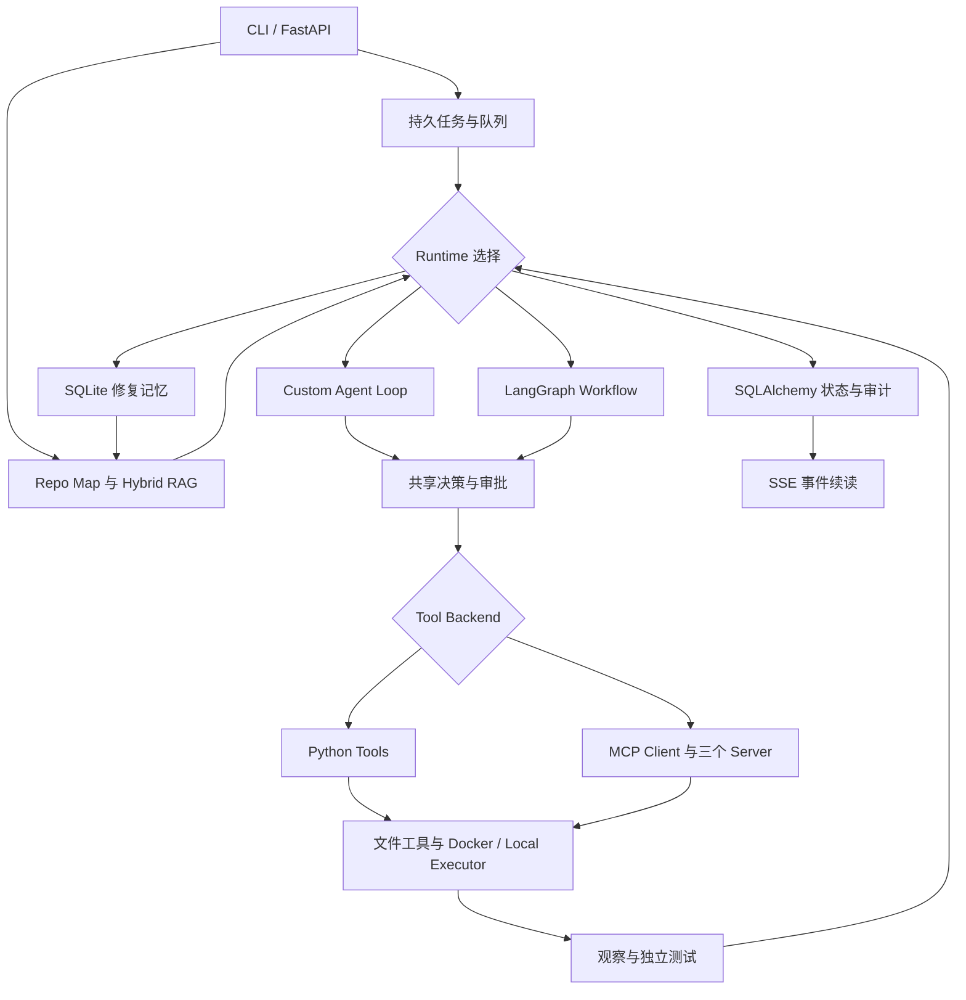
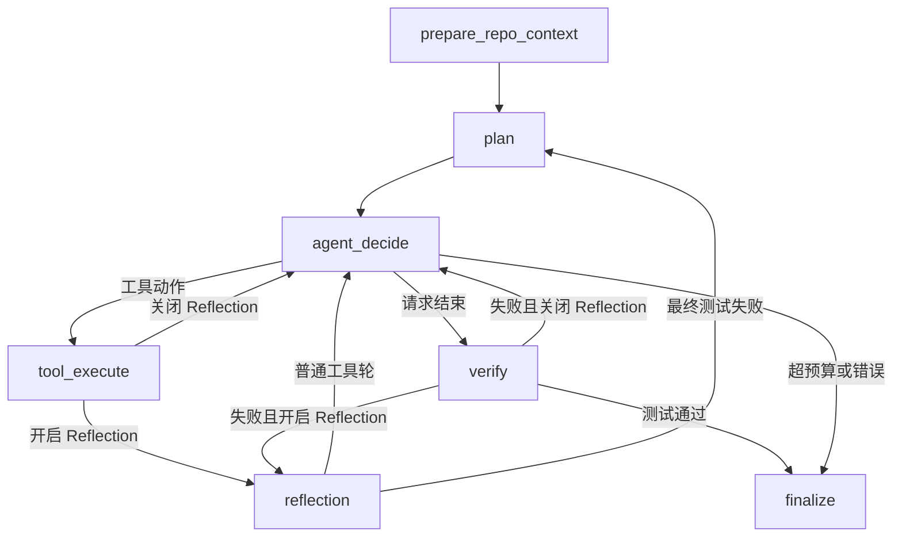

# RepoPilot 平台升级交付说明

这次升级从 GitHub 主分支 `0cc4886` 开始，保留 `agent/context/tools/llm/sandbox/api/session`。没有另起一套 Agent，也没有把自研循环塞进一个 LangGraph 节点。原有状态转换仍是核心，新增模块在它的接口上工作。

## 1. 新架构



CLI 直接调用 Runtime。API 先持久化任务再投递队列；图中这两种入口可以独立使用。RAG 与 Memory 输出参考材料，不能直接修改源码或宣布任务成功。

LangGraph 的节点和边如下；Custom Runtime 执行相同的共享转换：



`finalize` 遇到 failed 状态保留失败；成功路径还需要 Git diff。`InMemorySaver` 用于进程内节点检查与恢复；跨进程使用数据库中的 AgentState，从下一次决策继续，不宣称任意崩溃下工具 exactly-once。

## 2. 核心流程：一次重复邮箱修复怎么走

1. **准备上下文。** Repo Map 保留 Python 类、函数、签名与 import。选择 hybrid 后按 AST 边界分块，BM25 和向量分别召回，RRF 融合，再做符号和本地依赖重排。文件结果附分项分数、行号、原因。
2. **召回经验。** 若开启 Memory，按仓库检索类似且已通过测试的历史修复。经验作为参考进入 Planner 与上下文，不自动应用旧补丁。
3. **生成计划。** 模型返回经过 Pydantic 校验的 goal、steps、suspected_files 和 test_command。支持一次 JSON 修复；错误结果明确终止。
4. **决定与执行分离。** 模型只选择工具和参数。程序检查审批、路径与工具输入，Python 后端直接执行，MCP 后端通过官方 SDK 和 stdio 到服务器执行同一组工具。
5. **记录观察和反思。** 工具结果进入 ToolHistory。开启 Reflection 时模型输出 success、reason、next_action、needs_search；这份结构化结果进入下一次上下文，必要时重新检索。
6. **独立验证。** 模型请求完成后，程序重新执行原计划测试。失败进入 Reflection → Planner → Decide；重规划不能把测试换成 `true` 等更弱命令。补丁或可能修改代码的命令会使旧测试证据失效。
7. **保存可检查证据。** 每轮保存关系表、状态快照和事件；API 客户端可实时订阅或按 Last-Event-ID 续读。验证完成后保存 Git diff，并把经验写入 Memory。

反思会增加模型调用和 Token 成本。检索、Reflection、Memory 都有显式开关，便于对照评测，不靠功能数量解释效果。

## 3. 技术栈与取舍

| 技术 | 本项目实际承担什么 | 相比原方案的变化 | 当前边界 |
| --- | --- | --- | --- |
| Python / Pydantic | 自研 Runtime、结构化模型协议、工具参数 | 保留原执行语义 | 仍需处理模型选择错误 |
| LangGraph StateGraph | 显式状态节点、条件分支、进程内 checkpoint | 可检查 Reflection 与测试失败边 | 未接持久 LangGraph checkpointer |
| 官方 MCP Python SDK v2 | Agent Client 和 filesystem/git/shell stdio Server | 从只读对外工具扩展到 Agent 内部调用 | 固定三个本地 Server；未实现任意远端注册 |
| AST / rank-bm25 | 结构化代码片段和词项召回 | 检索词不再只有手写权重 | 多语言 AST 仍以 Python 为主 |
| Embedding / FAISS | 真实 embedding API，归一化内积检索 | 补充语义相似检索通路 | 未实测真实 embedding 召回质量 |
| RRF / import 图 | 融合异构分数，补充共享实现 | 输出可解释分项；依赖扩展最多两跳 | 小型基准上的诊断，不代表所有仓库 |
| SQLite FTS5 | 长期修复记忆 | 从会话历史扩展到类似任务召回 | 同仓库、关键词检索，非向量记忆 |
| SQLAlchemy | Task/Session/Step/ToolCall/TokenUsage/Event | 数据库替代默认 JSON 保存 | 初始 schema；后续改表需迁移 |
| FastAPI / asyncio | 异步接受任务与 worker 管理 | 从 BackgroundTasks 到可恢复的服务队列 | 一个 coordinator，内部多个 worker |
| Redis | 有界队列、processing 列表和 ack | 任务交接独立于 HTTP 请求 | 数据库负责待投递记录与领取去重 |
| PostgreSQL | 服务端任务状态、审计、仓库互斥 | 重启后可查询，关系数据可统计 | 非多租户高可用平台 |
| Docker / Compose | 命令沙箱、三服务部署 | 可重复启动 API、Redis、Postgres | Compose local 执行与 API 共容器 |
| pytest / GitHub Actions | 回归、真实协议、真实服务、容器验证 | 跨模块组合验证，生成证据 | FakeLLM 验证流程，不测模型智力 |
| OpenTelemetry | 原有 span、耗时和 Token 观察 | 保留已有可观测性 | 默认关闭，不记录代码正文 |

没有引入 Celery：当前 asyncio worker 配合 Redis 已满足单服务任务队列。没有再引入 LangChain Agent：它会与自研执行语义重复。FAISS 已提供所需向量能力，因此没有再增加向量数据库服务。

## 4. 数据与恢复

| 表或存储 | 作用 |
| --- | --- |
| Task | task、repo、status、请求选项和活动仓库互斥键 |
| Session | 可恢复的 AgentState 快照、内容摘要与事件版本 |
| Step | 决策步骤与动作 |
| ToolCall | 参数、观察、是否实际执行、缓存、退出码和耗时 |
| TokenUsage | chat 输入/输出/总 Token、embedding Token |
| Event | 按任务递增的事件序号与状态变化，供 SSE 重放 |
| memory.db | task/repo/solution/error/fix 与 verified 标记 |

POST 的 HTTP 202 表示任务已持久化，不表示任务已经完成。Redis 暂不可用时数据库 pending 行仍可重新投递。worker 用条件更新领取任务；重复队列消息不能绕过这次领取。同仓库唯一活动键防止两个 API 任务同时修改同一副本。

重启时 pending 重新投递，已领取的 running 标记 interrupted。不能把未知结果的 shell 再跑一次当成安全恢复。正常停止等待当前线程收尾；强杀进程后应先检查工作区。这个方案提供明确的恢复边界，没有宣称 exactly-once 副作用。

## 5. 建议的面试演示顺序

先执行 `python eval/demo.py --runtime custom`，解释最小循环。再执行：

```bash
python eval/demo.py --runtime langgraph --tool-backend mcp --retrieval hybrid --reflection --memory
```

打开 `runtime/langgraph_runtime.py`，指出真实节点和条件边；打开 `tools/backends.py`，证明 Agent 通过 MCP SDK 调用，而不是仅仅有一个 Server 文件；用 `repopilot retrieve REPO QUERY` 展示命中理由；最后演示 API 的 POST/GET/SSE 和数据库历史。

无密钥 Demo 的动作是固定的，面试时应主动说明。要证明真实修复效果，再给出相同代码版本、相同模型和任务集的真实模型报告。

## 6. 两分钟面试讲解

我做 RepoPilot 的出发点是：单次让模型生成补丁，既看不到执行过程，也无法确认它真的解决了问题。我先实现了自研 Agent Loop，把模型决策、工具执行、观察反馈和最终测试分开。模型只输出结构化动作，权限、路径、超时、循环预算和测试复验由程序控制。

之后我没有推翻这个循环，而是把相同的状态转换接到 LangGraph，让规划、工具执行、反思和测试失败后的重规划成为显式节点。这样能比较两种编排方式，测试语义也保持一致。Reflection 会解释失败和给出下一步，但不能代替测试结果，重规划也不能降低原测试要求。

工具层保留 Python 调用，同时接入官方 MCP Client，通过三个 stdio Server 调用文件、Git 和 shell 工具。检索使用 AST 分块、BM25、embedding 和 FAISS，两路结果融合后再结合符号与依赖关系重排。我遇到过关键词把调用方排在共享实现前面的问题，因此保留了 import 依赖扩展，并把召回原因直接展示出来。

工程侧使用 SQLAlchemy 保存任务、步骤、调用和 Token，SQLite 保存修复经验。API 提交后由后台 worker 执行，Redis 负责任务交接，数据库保证任务可查询和领取去重，SSE 展示实时进度。评测使用 25 个 Bug 任务及隐藏测试，并区分脚本化流程验证和真实模型效果。当前项目的价值是闭环可解释、状态可追踪和组件可以单独对照，不是声称能自动修复任意项目。

## 7. STAR：先讲故事，再写简历

**S：** 原始 Coding Agent 已能读仓库、打补丁和执行测试，但仅靠自研循环与 JSON 会话，难以展示状态分支、复用工具协议、保留可查询任务历史。

**T：** 在保留原架构和测试语义的前提下，完成可解释、可验证的 Coding Agent 平台升级。

**A：** 保留 Custom Runtime，增加 LangGraph 节点编排和结构化 Reflection；通过统一 ToolBackend 接入 MCP；基于 AST/BM25/FAISS 构建混合检索；使用 SQLAlchemy、Redis、SQLite Memory 和 SSE 打通长任务持久化与过程观察；扩展隐藏测试评测和 CI。

**R：** 两组 25 任务的脚本化组合回归均通过；真实 MCP stdio、Redis/PostgreSQL API 和 Compose 在 CI 验证。最终自动测试数量与 CI 链接以 [验证记录](21-platform-validation.md) 为准。真实模型修复率、Token 节省、语义召回收益没有在本轮重新测量。

**可直接放简历的写法：**

- 基于 Python 实现 Coding Agent 平台，保留自研 Agent Loop 并接入 LangGraph 状态编排，通过结构化规划、Reflection 与独立测试复验完成代码理解、补丁修改和失败重试闭环。
- 设计统一 Python/MCP 工具后端，基于官方 MCP SDK 提供文件、Git、Shell 工具服务，复用路径校验、审批、超时及 Docker 执行器，支持运行模式切换与工具调用审计。
- 构建 AST 分块、BM25 与 FAISS 混合代码检索，通过 RRF、符号匹配及 import 依赖重排生成可解释上下文；结合 SQLite 修复记忆召回同仓库已验证经验。
- 使用 FastAPI、Redis、SQLAlchemy/PostgreSQL 实现异步任务、持久状态与 SSE 进度续读，构建 25 任务隐藏测试评测流水线，覆盖双 Runtime、MCP、检索、Memory 与服务集成回归。

建议项目名称用“RepoPilot：可解释 Coding Agent 平台”。尚未实现认证、租户隔离和生产负载验证，简历不宜直接写“已落地企业级平台”。不要把 FakeLLM 的 25/25 写成真实模型自动修复率 100%。

## 8. 新增文件清单

源码新增文件：

| 目录 | 文件 |
| --- | --- |
| runtime/ | custom_runtime.py、langgraph_runtime.py（旧 langgraph.py 保留导入兼容） |
| agent/ | reflection.py |
| tools/ | backends.py |
| mcp_server/ | __init__.py、__main__.py、common.py、filesystem_server.py、git_server.py、shell_server.py |
| context/ | chunks.py、embeddings.py、hybrid.py |
| database/ | __init__.py、models.py、store.py、coordinator.py |
| memory/ | __init__.py、store.py |
| api/ | queue.py、tasks.py |
| eval/ | report.py |
| tests/ | test_reflection.py、test_mcp_backend.py、test_hybrid_retrieval.py、test_database_memory.py、test_api_tasks.py、test_service_integration.py、test_platform_evaluation.py、test_sse_live.py |
| .github/workflows/ | platform-services.yml |
| docs/ | 19-platform-upgrade-plan.md、20-platform-handoff.md、21-platform-validation.md |
| eval/evidence/2026-10-02-platform/ | README.md、platform-custom.json、platform-custom.md、platform-langgraph-mcp.json、platform-langgraph-mcp.md、platform-retrieval.json、platform-ci.json、platform-ci.md |

`mcp_server.py` 迁入包的 `__init__.py`，旧导入与 `python -m repopilot.mcp_server` 兼容。主要修改文件包括 agent/state/prompts、config、cli、context/manager、session/store、api/server、tools/git、三个评测入口、Dockerfile、Compose、依赖、README 和已有 CI。精确清单可查看 PR Files changed。
